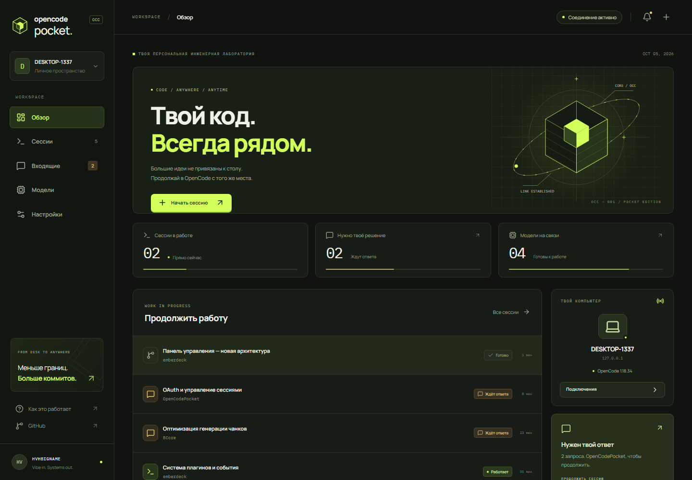
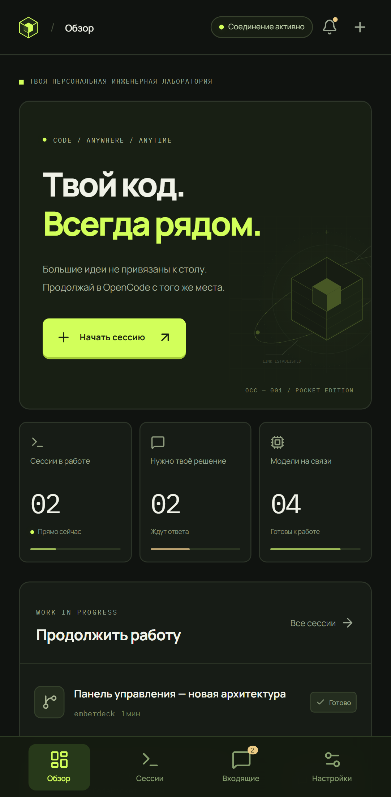

<p align="center"></p>

<p align="center">
  <a href="https://github.com/HVHBIGNAME/OpenCodePocket/releases/latest"><b>Скачать APK / IPA</b></a> &nbsp; / &nbsp;
  <a href="docs/connect.md">Подключение</a> &nbsp; / &nbsp;
  <a href="docs/build.md">Собрать самому</a> &nbsp; / &nbsp;
  <a href="docs/notifications.md">Уведомления</a>
</p>

# OpenCode Pocket / OCC

**Твой код. Всегда рядом.** Мобильный клиент [OpenCode](https://opencode.ai) для Android и iOS. Продолжай сессии с компьютера, отправляй промпты, отвечай на вопросы и управляй моделями — с телефона.

Графит, оливковые поверхности, лаймовое геометрическое ядро. Дизайн продолжает визуальный язык [HVHBIGNAME](https://github.com/HVHBIGNAME): *Vibe in. Systems out.*

## Что умеет

| | |
| --- | --- |
| **Подключиться за минуту** | Плагин-мост, одноразовый QR, свой HTTPS-туннель, Wi-Fi/VPN или прямое подключение к OpenCode. |
| **Продолжить на телефоне** | Актуальные сессии, потоковый текст, инструменты, задачи, файлы и патчи. Создание, переименование и ответвление сессий. |
| **Оставаться в диалоге** | Промпты, картинки/PDF, slash-команды, остановка генерации, вопросы с несколькими ответами и разрешения. |
| **Настроить интеллект** | Модели, агенты, варианты, параметры, API-ключи и свои OpenAI-совместимые провайдеры. |
| **Задать правила** | Автодоступ, подтверждение отдельных действий, правила по шаблонам и JSON-редактор `permission`. |
| **Надиктовать мысль** | Android SpeechRecognizer / iOS Speech. Строгое распознавание на устройстве включено по умолчанию. |
| **Не пропустить вопрос** | Android: фоновый сервис. iOS: APNs с настроенной подписью и ключом на мосте. Внешний push-канал ntfy также поддерживается. |
| **Контролировать доступ** | Отдельный ключ на каждое устройство, список устройств и отзыв доступа. Android Keystore + AES-256-GCM, iOS Keychain. |

Независимый проект, не официальный продукт Anomaly. Нет встроенной аналитики, аккаунта OCC или обязательного облачного backend. Выбранный туннель и AI-провайдер работают по своим правилам.

## Установка

**Android:** скачай `OpenCodePocket-1.0.0-android.apk` из [Releases](https://github.com/HVHBIGNAME/OpenCodePocket/releases/latest). APK подписан постоянным ключом проекта. Android 8+.

**iOS:** скачай `OpenCodePocket-1.0.0-ios-unsigned.ipa`. Это скомпилированный arm64 IPA для iOS 15+, **без Apple-подписи**. Для установки нужна самостоятельная подпись через Sideloadly/AltStore или свою Apple Developer-команду. Фоновый APNs требует подходящих entitlements и provisioning profile. [Подробнее](docs/build.md#ios).

### Компьютер → телефон

Установи [Node.js 22+](https://nodejs.org/) и [cloudflared](https://developers.cloudflare.com/cloudflare-one/connections/connect-networks/downloads/), затем:

```sh
npm install -g https://github.com/HVHBIGNAME/OpenCodePocket/releases/download/v1.0.0/hvhbigname-occ-bridge-1.0.0.tgz
occ-pocket install --tunnel
opencode --port 4096
```

1. После установки плагина **перезапусти OpenCode** с указанным портом.
2. Открой `~/.config/opencode/occ-pocket/pairing.html` (Windows: `%USERPROFILE%\.config\opencode\occ-pocket\pairing.html`).
3. В OCC: **Подключить компьютер → Сканировать QR-код → Подключиться**.

Новый одноразовый QR: `occ-pocket pair`. Срок действия — 10 минут. Секрет OpenCode не попадает в QR. Устройства можно отозвать в настройках OCC.

Если OpenCode уже слушает порт, можно подключить мост без перезапуска:

```sh
occ-pocket start --upstream http://127.0.0.1:4096 --tunnel
```

Важно подключаться к **тому же процессу OpenCode**, в котором идёт работа. Другой `opencode serve` видит сохранённые сессии, но не переносит выполняющийся инструмент и ожидающие в памяти вопросы из первого процесса.

Свой туннель: `--url https://your-tunnel.example` вместо `--tunnel`. Локальная сеть/VPN: `--lan`. [Все сценарии →](docs/connect.md)

## Интерфейс

<p align="center"></p>
<p align="center"> &nbsp;  &nbsp; </p>

Скриншоты используют воспроизводимые тестовые сессии. Рабочее приложение показывает данные подключённого сервера.

## Разработка

```sh
npm ci
npm run dev              # http://127.0.0.1:1420
npm run check            # TypeScript + protocol/bridge/reducer tests
npx playwright install chromium webkit
npm run test:e2e         # Browser + Android layout + iOS WebKit
npm run build            # Web UI + bundled companion
npm run native:sync      # Sync web assets to native projects
```

Браузерная версия хранит ключи только в памяти вкладки. Для браузерной разработки разреши origin на мосте: `occ-pocket start --origin http://127.0.0.1:1420`. Нативный клиент использует системный HTTP и не зависит от браузерного CORS.

```
src/                         React + TypeScript, интерфейс и клиент API
shared/                      QR-протокол, SSE decoder, уведомления
packages/bridge/             Плагин OpenCode, CLI, прокси, APNs/ntfy
android/                     Android shell, AES-GCM vault, speech, event service
ios/                         iOS shell, Keychain, speech, SSE, APNs registration
tests/                       Unit, integration, browser and native QA
docs/                        Подключение, подпись, ограничения, дизайн
```

Сборки запускаются в [GitHub Actions](https://github.com/HVHBIGNAME/OpenCodePocket/actions). Публикация APK/IPA и companion происходит только по тегу `v*`, после успешных проверок.

## Возможности и границы версии 1.0

- Код и инструменты исполняются **на компьютере**. Телефон — полноценный клиент этого процесса.
- Офлайн-диктовка зависит от устройства и языкового пакета; для Android используется именно on-device API (Android 12+). Если его нет, приложение объясняет причину, не переключая аудио в облако автоматически.
- В фоне iOS нельзя держать обычный SSE бесконечно. Для настоящей фоновой доставки настрой [APNs или ntfy](docs/notifications.md). IPA без подходящей подписи не получает APNs.
- При пропадании сети включается переподключение. Неуспешные промпты сохраняются в черновике; автоматической повторной отправки, способной продублировать задачу, нет.
- Бесплатный Cloudflare Quick Tunnel меняет адрес при перезапуске и требует нового подключения. Для постоянного адреса используй именованный туннель/VPN.
- OAuth-вход провайдера выполняется на компьютере; подключённые модели доступны в OCC. API-ключи можно добавлять с телефона.

Проверки и фактические результаты перечислены в [docs/verification.md](docs/verification.md). Ветка исследований локального исполнения появится отдельно от релиза 1.0.

---

**[HVHBIGNAME](https://github.com/HVHBIGNAME)** · Independent software · [MIT](LICENSE)
